# Dominance-Analysis : A Python Library for Accurate and Intuitive Relative Importance of Predictors 
[](https://pepy.tech/project/dominance-analysis) 
<a href="https://github.com/bhagatsajan0073/dominance_analysis/blob/master/LICENSE">
  
</a>
 
<a href="https://github.com/bhagatsajan0073/dominance_analysis/stargazers">
  
</a>
[](https://travis-ci.org/bhagatsajan0073/dominance_analysis)

*This package is designed to determine relative importance of predictors for both regression and classification models. The determination of relative importance depends on how one defines importance; Budescu (1993) and Azen and Budescu (2003) proposed using dominance analysis (DA) because it invokes a general and intuitive definition of "relative importance" that is based on the additional contribution of a predictor in all subset models. The purpose of determining predictor importance in the context of DA is not model selection but rather uncovering the individual contributions of the predictors.*

*In case the target is a continuous variable, the package determines the dominance of one predictor over another by comparing their incremental R-squared contribution across all subset models. In case the target variable is binary, the package determines the dominance over another by comparing their incremental Pseudo R-Squared contribution across all subset models.*

<hr>

### Installation

Use the following command to install the package:
```  
pip install dominance-analysis
```  
<hr>

## Important Parameters 
 
  * data : Complete Dataset, should be a Pandas DataFrame.   
  * target : Name of the target variable, it should be present in passed dataset.
  * top_k : No. of features to choose from all available features. By default, the package will run for top 15 features.
  * objective : It can take value either 0 or 1. 0 for Classification and 1 for Regression. By default, the package will run for Regression.
  * pseudo_r2 : It can take one of the Pseudo R-Squared measures - "mcfadden","nagelkerke", "cox_and_snell" or "estrella", where default="mcfadden". It's not needed in case of regression (objective=1).

<hr>

### Dominance Analysis - The Significance!

Dominance Analysis, according to Azen and Budescu meets three important criteria for measuring relative importance. First, the technique should be defined in terms of its ability to reduce error in predicting the outcome variable. Next, it should permit direct comparison of measures within a model (that is, X<sub>1</sub> is twice as important as X<sub>2</sub>). Finally, the technique should permit inferences concerning an attribute's direct effect (that is, when considered by itself), total effect (that is, when considered with other attributes) and partial effect (that is, when considered with various combinations of other predictors). Hence, Dominance analysis is both robust and intuitive and its interpretation is also very straightforward.


### Dominance Analysis - The Math!

Dominance Analysis is unique as it measures relative importance in a pairwise fashion, and the two predictors are compared
in the context of all 2<sup>(p−2)</sup> models that contain some subset of the other predictors. So, if we have a total of 'p' predictors, we will build 2<sup>p</sup>-1 models (all possible subset models) and compute the incremental R<sup>2</sup> contribution of each predictor to the subset model of all other predictors. The additional contribution of a given predictor is measured by the increase in R<sup>2</sup> that results from adding that predictor to the regression model.

Let's consider a scenario when we have 4 predictors; X<sub>1</sub>, X<sub>2</sub>, X<sub>3</sub> and X<sub>4</sub>. We will have to build a total of 2<sup>4</sup>-1 models i.e. 15 models- <sup>4</sup>C<sub>1</sub> = 4 models with only one predictor, <sup>4</sup>C<sub>2</sub> = 6 models with two predictors each, <sup>4</sup>C<sub>3</sub> = 4 models with three predictors each and 1  (<sup>4</sup>C<sub>4</sub>) complete model with all 4 predictors. Thus, the additional contributions of X<sub>1</sub> are computed as the increases in the proportion of variance accounted for when X<sub>1</sub> is added to each subset of the remaining predictors (i.e., the null subset {.}, {X<sub>2</sub>}, {X<sub>3</sub>}, {X<sub>4</sub>}, {X<sub>2</sub>X<sub>3</sub>}, {X<sub>2</sub>X<sub>4</sub>}, {X<sub>3</sub>X<sub>4</sub>} and {X<sub>2</sub>X<sub>3</sub>X<sub>4</sub>}). Similarly, the additional contributions of X<sub>2</sub> are the increases in the proportion of variance accounted for when X<sub>2</sub> is added to each subset of the remaining predictors (i.e., the null subset {.}, {X<sub>1</sub>}, {X<sub>3</sub>}, {X<sub>4</sub>}, {X<sub>1</sub>X<sub>3</sub>}, {X<sub>1</sub>X<sub>4</sub>}, {X<sub>3</sub>X<sub>4</sub>} and {X<sub>1</sub>X<sub>3</sub>X<sub>4</sub>})

Below is the illustration of formulas used to compute the averaged additional contributions of X<sub>1</sub> and X<sub>2</sub> within model size in the poupulation with four predictors (We use the notation  to represent the proportion of variance in Y that is accounted for by the predictors in the model X. For example, represents the proportion of variance in Y that is accounted for by the model consisting of X<sub>1</sub> and X<sub>3</sub>. The additional contribution of a given predictor is measured by the increase in proportion of variance that results from adding that predictor to the regression model):


The measure for proportion of variance that we have used for regression is R<sup>2</sup> but since we don't have R<sup>2</sup> in logsitic regression/classification models, we have used Pseudo R<sup>2</sup>.


The beauty of the math of Dominance Analysis is that the sum of the  overall average incremental R<sup>2</sup> of all predictors is equal to the R<sup>2</sup> of the complete model (model with all predictors). Hence, the total R<sup>2</sup> can be attributed to each predictor in the model. Below is an illustration of Dominance Analysis in the Population for Hypothetical example with four predictors:

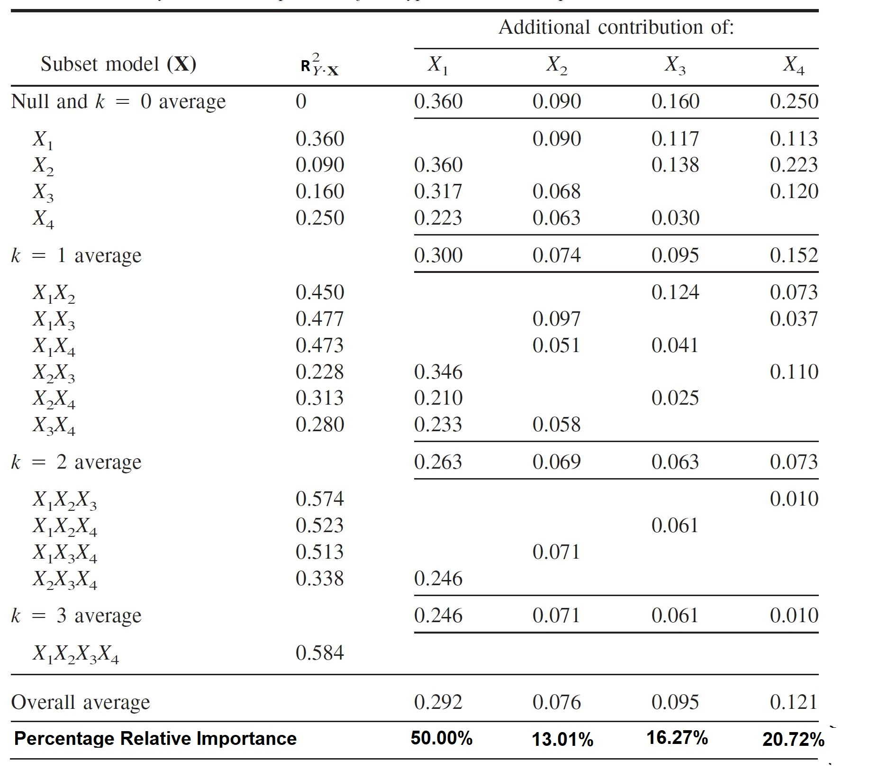

It can bee seen that the Percentage Relative Importance of predictors has been computed by dividing the Overall Average Incremental R<sup>2</sup> contribution of predictors by the R<sup>2</sup> of the complete model. This explains the intuitive nature of Dominance Analysis wherein the overall R<sup>2</sup> of the model can be attributed to individual predictors within the model.


<hr>

### Pseudo R-Squared for Classification Task / Logistic Regression

Measures of fit in logistic regression can be classified by those based on sums of squares and those based on maximum likelihood statistics. Reviews of a variety of measures of fit proposed for logistic regression can be found in Amemiya (1981), Menard (2000), Mittlbock and Schemper (1996) and Zheng and Agresti (2000). Given the large number of proposed measures, criteria for defining appropriate R<sup>2</sup> analogues need to he determined. The following criteria, which are also found in the linear regression literature (e.g., Kvilseth. 1985: Van den Burg & Lewis, 1988), were used to select R<sup>2</sup> analogues for logistic regression:
1. Boundedness: The measure should vary between a minimum of zero, indicating complete lack of fit, and a maximum of one, indicating perfect fit. 
2. Linear invariance: The measure should be invariant to nonsingular linear transformations of the variables (Ys and Xs). 
3. Monotonicity: The measure should not decrease with the addition of a predictor.
4. Intuitive Interpretability: The measure of fit is intuitively interpretable, in that it agrees with the scale of the linear case for intermediate values.

Based on these criteria, the following four R<sup>2</sup> analogues were chosen that satisfied at least three of these four properties:

**1. McFadden's Pseudo-R Squared**

 McFadden's Pseudo-R squared measure is defined as :


This measure satisfies all the four properties.

**2. Nagelkerke Pseudo-R Squared**

Nagelkerke Pseudo-R squared measure is defined as :


This measure satisfies three of the four properties and doesn't satisfy the property of Interpretability.

**3. Cox and Snell R-Squared**

Cox and Snell Pseudo-R squared measure is defined as :


This measure satisfies three of the four properties.

**4. Estrella R-Squared**

Estrella Pseudo-R squared measure is defined as :


This measure satisfies all the four properties.

Using each of these four R<sup>2</sup> analogues, the additional contribution of a given predictor to a specific logistic model can be measured as the change (i.e., increase) in the R<sup>2</sup> analogues when the predictor is added to the model. Even though, all the four measures will give similar results, we recommend using either Estrella's (1998) model fit measure or McFadden's (1974) measure for conducting dominance analysis in logistic regression. We have a slight preference for McFadden's measure (and that is what the package will compute by default) because it is computationally simpler, but both McFadden's and Estrella’s measures satisfy the minimum requirements for an R<sup>2</sup> analogues.

<hr>

Note: Since, Dominance Analysis is computationally intensive as it builds all subset model (2<sup>p</sup>-1 models), we have provided the user the flexibility to choose number of top predictors that they want to compute relative importance for. For regression, Top K features are selected based on F-regression and for classification it is based on Chi-Squared statistic. Dominance Analysis can be used in combination with Principal Component Analysis (PCA) or Factor Analysis or any other feature reduction algorithm for getting accurate and intutive importance of predictors.

<hr>

### Dominance Statistics

As described earlier, a relative importance measure should be able to describe a predictor's direct, total and partial effet, therefore in the Dominance Statistics, we have come up with four different types of Dominance measures. Below are the definition and interpretation of the measures:

1. Interactional Dominance - This is the incremental R<sup>2</sup> contribution of the predictor to the complete model. Hence, the Interactional Dominance of a particular predictor 'X' will be the diffrence between the R<sup>2</sup> of the complete model and the R<sup>2</sup> of the model with all other predictors except the particular predictor 'X'. <br>
Consider a scenario when we have Y as the dependent variable and four predictors X<sub>1</sub>, X<sub>2</sub>, X<sub>3</sub> and X<sub>4</sub>, let  R<sup>2</sup><sub>Y.X<sub>1</sub>,X<sub>2</sub></sub> be the R<sup>2</sup> of the model between Y and X<sub>1</sub>, X<sub>2</sub> ;
R<sup>2</sup><sub>Y.X<sub>1</sub>,X<sub>3</sub></sub> be the R<sup>2</sup> of the model between Y and X<sub>1</sub>, X<sub>3</sub> so on and so forth. In this case, the interactional dominance of predictor X<sub>1</sub> will be R<sup>2</sup><sub>Y.X<sub>1</sub>,X<sub>2</sub>,X<sub>3</sub>,X<sub>4</sub></sub> - R<sup>2</sup><sub>Y.X<sub>2</sub>,X<sub>3</sub>,X<sub>4</sub></sub>. <br>
Hence, interactional dominance can be interpreted as the incremental impact or the dominance that a predictor has in presence of all other predictors.

2. Individual Dominance -
3. Average Partial Dominance -
4. Total Dominance -


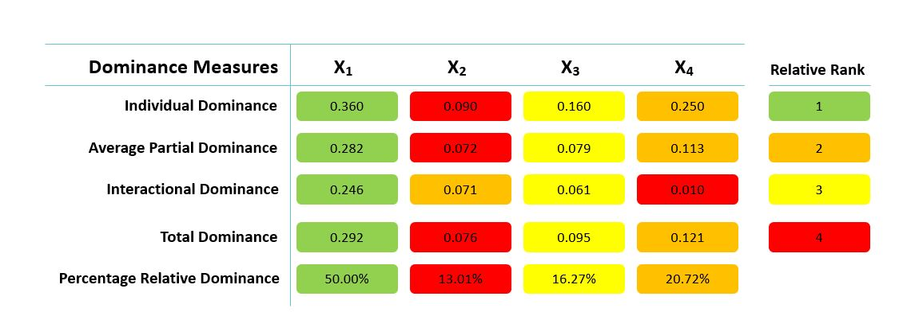

<hr>

*Complete code for below examples is available in example folder or the following public kernels on kaggle:
Regression - <a href="https://www.kaggle.com/iamsajanbhagat/dominance-analysis-on-boston-house-prices-dataset" target="_blank">Dominane Analysis on Boston House Price Data</a> &
Classification- <a href="https://www.kaggle.com/iamsajanbhagat/dominance-analysis-on-breast-cancer-dataset" target="_blank"> Dominance Analysis on Breast Cancer Dataset</a>*

<hr>

### User Guide for computing Relative Importance when the response variable is Continous

**Using Boston Housing Dataset downloaded from: https://www.cs.toronto.edu/~delve/data/boston/bostonDetail.html**

**Selecting top K features and getting R<sup>2</sup> of the Complete Model**

```
from dominance_analysis import Dominance_Datasets
from dominance_analysis import Dominance
boston_dataset=Dominance_Datasets.get_boston()
dominance_regression=Dominance(data=boston_dataset,target='House_Price',objective=1)
``` 
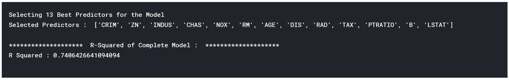

<hr>

**Incremental R-Squared**
```
incr_variable_rsquare=dominance_regression.incremental_rsquare()
```


<hr>

**Plot Incremental R-Squared and the Dominance Curve**
```
dominance_regression.plot_incremental_rsquare()
```
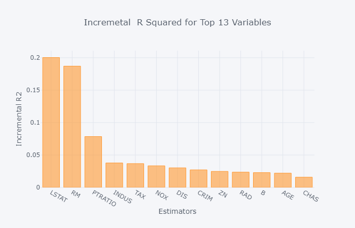
<hr>
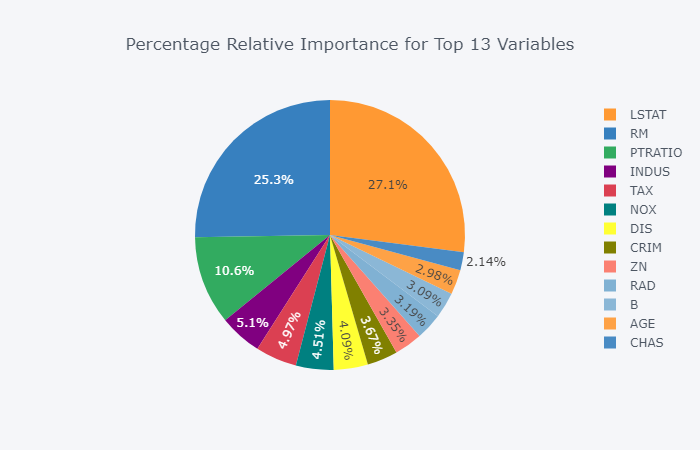
<hr>


**Dominance Statistics (R-Squared)**
```
dominance_regression.dominance_stats()
```
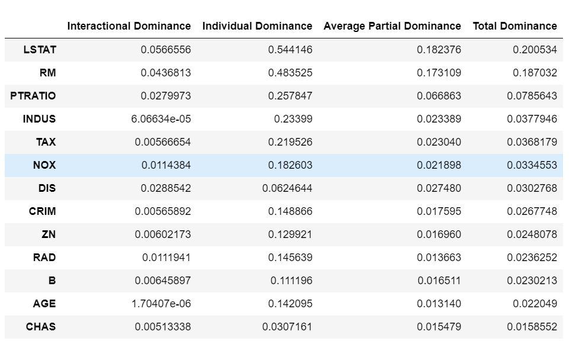


<hr>


### User Guide for computing Relative Importance when the response variable is Binary

**Breast Cancer Wisconsin (Diagnostic) dataset downloaded from: https://goo.gl/U2Uwz2**

**Selecting top K features and getting Pseudo R<sup>2</sup> of the Complete Model**
```
from dominance_analysis import Dominance_Datasets
from dominance_analysis import Dominance
breast_cancer_data=Dominance_Datasets.get_breast_cancer()
dominance_classification=Dominance(data=breast_cancer_data,target='target',objective=0,pseudo_r2="mcfadden")
``` 
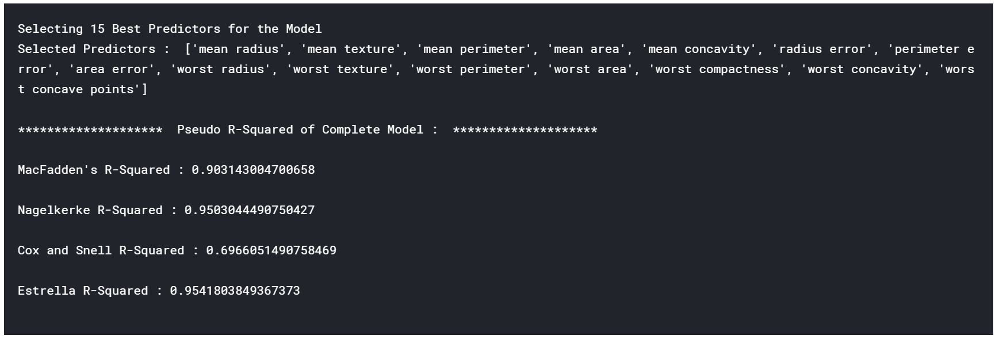

<hr>

**Incremental Pseudo R-Squared**
```
incr_variable_rsquare=dominance_classification.incremental_rsquare()
```
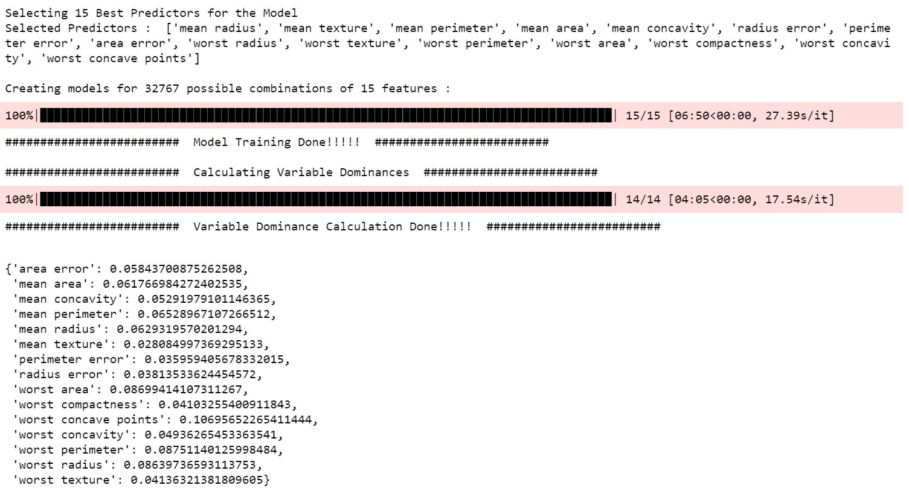

<hr>

**Plot Incremental Pseudo R-Squared**
```
dominance_classification.plot_incremental_rsquare()
```
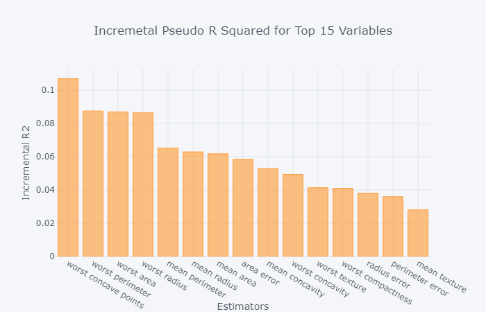
<hr>
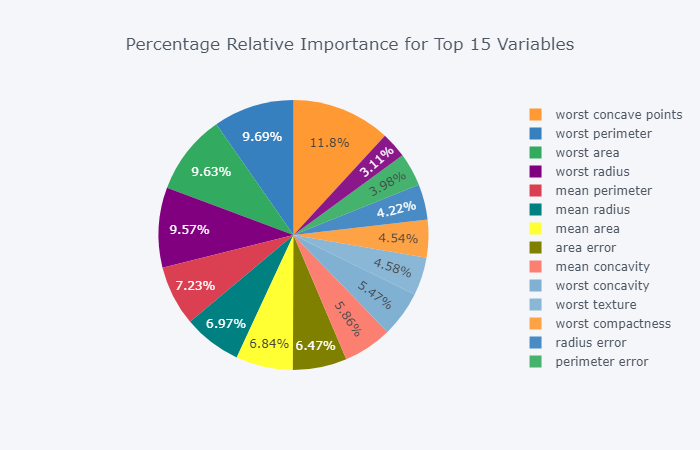
<hr>


**Dominance Statistics (R-Squared)**
```
dominance_classification.dominance_stats()
```
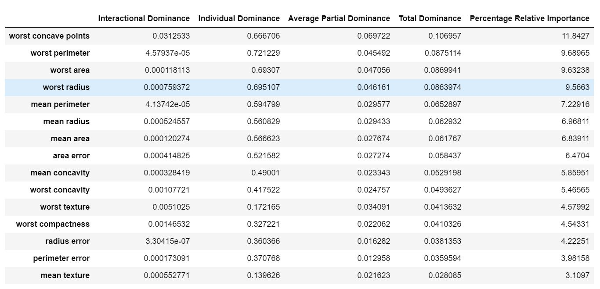

<hr>

### Authors & License
The Dominance Analysis package is based on the concept developed by Azen and Budescu (see references). This package is released under a <a href="dominance_analysis/LICENSE"> MIT License</a>. Dominance Analysis Python package has been developed by <a href="https://github.com/quintshekhar"> Shashank Shekhar</a>, <a href="https://github.com/bhagatsajan0073"> Sajan Bhagat</a> and <a href="https://github.com/Vibish"> Kunjithapatham Sivakumar</a> . Pull requests submitted to the GitHub Repo are highly encouraged!

<hr>

### References
1. Azen, R. (2000). Inference for predictor comparisons:Dominance analysis and the distribution of R<sup>2</sup> differences. Dissertation Abstracts International B, 61/10, 5616.
2. Azen, R., Budescu, D. V., & Reiser, B. (2001). Criticality of predictors in multiple regression. British Journal of Mathematical and Statistical Psychology, 54, 201–225.
3. Azen, R., Budescu, D. V. (2003). The Dominance Analysis Approach for Comparing Predictors in Multiple Regression. Psychological Methods, 2003, Vol. 8, No. 2, 129–148. https://doi.org/10.1037/1082-989X.8.2.129
4. Azen, R., Budescu, D. V. (2006). Comparing Predictors in Multivariate Regression Models: An Extension of Dominance Analysis. Journal of Educational and Behavioral Statistics Summer 2006, Vol. 31, No. 2, pp. 157-180. https://doi.org/10.3102/10769986031002157
5. Azen, R., Traxel, N. (2009). Using Dominance Analysis to Determine Predictor Importance in Logistic Regression. Journal of Educational and Behavioral Statistics September 2009, Vol. 34, No. 3, pp. 319-347. https://doi.org/10.3102/1076998609332754
6. Budescu, D. V. (1993). Dominance analysis: A new approach to the problem of relative importance of predictors in multiple regression. Psychological Bulletin, 114(3), 542-551. https://doi.org/10.1037/0033-2909.114.3.542
7. Luo, W., & Azen, R. (2013). Determining Predictor Importance in Hierarchical Linear Models Using Dominance Analysis. Journal of Educational and Behavioral Statistics, 38(1), 3-31. https://doi.org/10.3102/1076998612458319
