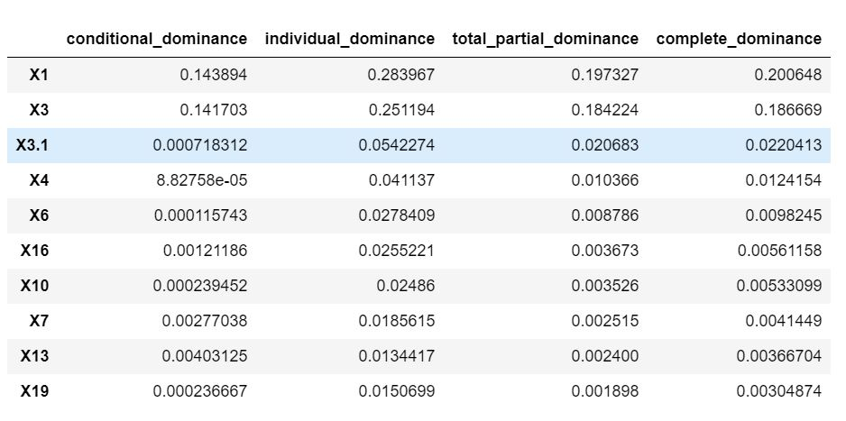

# Dominance Analysis for Accurate and Intuitive Relative Importance of Predictors

*This package is designed for regression task where-in provided with a dataset and continous target variable, the package returns the Incremental R-Square that any variable will add to total R-Square of the model. As the complexity of the algorithm increases with number of features, we have in-built functionality that chooses the <b>K=15</b> best features from all the estimators and returns incremental R-Square each variable all to the total R-Square of the model.*

<hr>

**Installation**
```  
pip install dominance-analysis
```  
<hr>

**Important Parameters**
 
  * data : Complete Dataset, should be a Pandas DataFrame.   
  * target : Name of target variable, it should be present in passed dataset.
  * top_k : No. of features to choose from all available features.
  * objective : It can take value either 0 or 1.    0 for Classification Task and 1 for Regression Task
  * pseudo_r2 : It can have value "mcfadden","nagelkerke","cox_and_snell" or "estrella" where default="mcfadden". It's not needed in         case of regression task (objective=1)

### PSEUDO R-Square for Classification Task / Logistic Regression
Logistic regression models are fitted using the method of maximum likelihood - i.e. the parameter estimates are those values which maximize the likelihood of the data which have been observed.

**1. McFadden's Pseudo-R Square**

 McFadden's Pseudo-R squared measure is defined as :


**2. Nagelkerke Pseudo-R Square**

Nagelkerke Pseudo-R squared measure is defined as :


**3. Cox and Snell R-Square**

Cox and Snell Pseudo-R squared measure is defined as :


**4. Estrella R-Square**

Estrella Pseudo-R squared measure is defined as :


<hr>

**User Guide for Regression Task**
```
from dominance_analysis import Dominance
import pandas as pd
data=pd.read_excel("./Book2.xlsx")                           # file is available in data folder 
dominance=Dominance(data=data,target='Y',top_k=10,objective=1)
``` 


<hr>

**Incremental R-Square**
```
incr_variable_rsquare=dominance.incremental_rsquare()
```


<hr>

**Plot Incremental R-Square**
```
dominance.plot_incremental_rsquare()
```

<hr>

<hr>


**Dominance Statistics (R-Square)**
```
dominance.domiance_stats()
```


