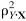
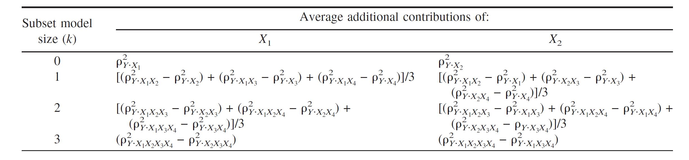
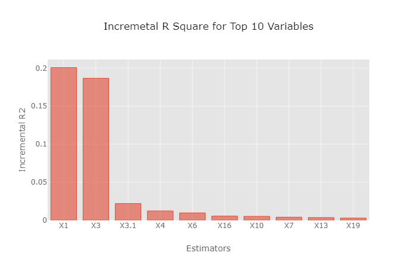
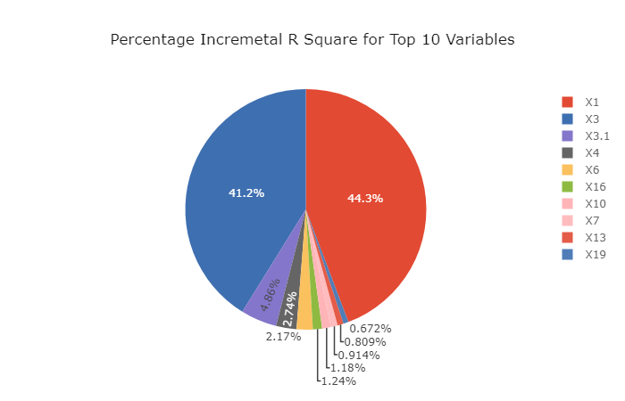
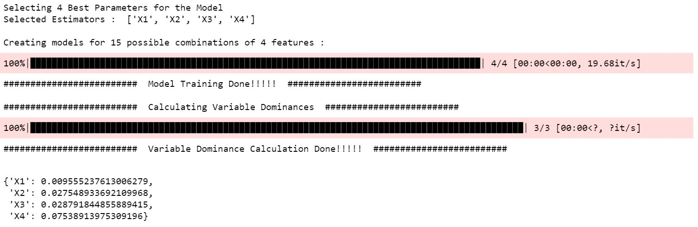
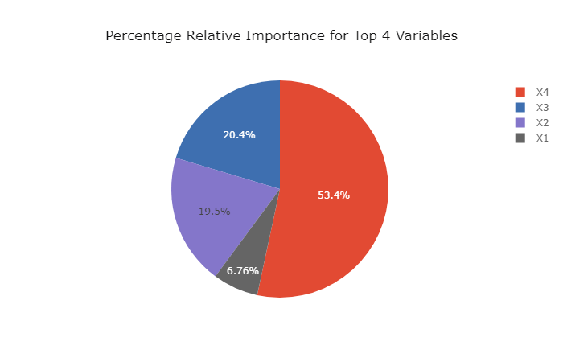

# Dominance Analysis for Accurate and Intuitive Relative Importance of Predictors

*This package is designed to determine relative importance of predictors for both regression and classification models. The determination of relative importance depends on how one defines importance; Budescu (1993) and Azen and Budescu (2003) proposed using dominance analysis (DA) because it invokes a general and intuitive definition of "relative importance" that is based on the additional contribution of a predictor in all subset models. The purpose of determining predictor importance in the context of DA is not model selection but rather uncovering the individual contributions of the predictors.*

*In case the target is a continuous variable, the package determines the dominance of one predictor over another by comparing their incremental R-squared contribution across all subset models. In case the target variable is binary, the package determines the dominance over another by comparing their incremental Pseudo R-Squared contribution across all subset models.*

<hr>

### Installation

Use the following command to install the package:
```  
pip install dominance-analysis
```  
<hr>

## Important Parameters 
 
  * data : Complete Dataset, should be a Pandas DataFrame.   
  * target : Name of the target variable, it should be present in passed dataset.
  * top_k : No. of features to choose from all available features. By default, the package will run for top 15 features.
  * objective : It can take value either 0 or 1. 0 for Classification and 1 for Regression.
  * pseudo_r2 : It can take one of the Pseudo R-Squared measures - "mcfadden","nagelkerke", "cox_and_snell" or "estrella", where default="mcfadden". It's not needed in case of regression (objective=1)

### Dominance Analysis - The Significance!

Dominance Analysis, according to Azen and Budescu meets three important criteria for measuring relative importance. First, the technique should be defined in terms of its ability to reduce error in predicting the outcome variable. Next, it should permit direct comparison of measures within a model (that is, X<sub>1</sub> is twice as important as X<sub>2</sub>). Finally, the technique should permit inferences concerning an attribute's direct effect (that is, when considered by itself), total effect (that is, when considered with other attributes) and partial effect (that is, when considered with various combinations of other predictors. Hence, Dominance analysis is both robust and intuitive and its interpretation is also very straightforward.


### Dominance Analysis - The Maths!

Dominance Analysis is unique as it measures relative importance in a pairwise fashion, and the two predictors are compared
in the context of all 2<sup>(p−2)</sup> models that contain some subset of the other predictors. So, if we have a total of 'p' predictors, we will build 2<sup>p</sup>-1 models (all possible subset models) and compute the incremental R<sup>2</sup> contribution of each predictor to the subset model of all other predictors. The additional contribution of a given predictor is measured by the increase in R<sup>2</sup> that results from adding that predictor to the regression model.

Let's consider a scenario when we have 4 predictors; X<sub>1</sub>, X<sub>2</sub>, X<sub>3</sub> and X<sub>4</sub>. We will have to build a total of 2<sup>4</sup>-1 models i.e. 15 models- <sup>4</sup>C<sub>1</sub> = 4 models with only one predictor, <sup>4</sup>C<sub>2</sub> = 6 models with two predictors each, <sup>4</sup>C<sub>3</sub> = 4 models with three predictors each and 1  (<sup>4</sup>C<sub>4</sub>) complete model with all 4 predictors. Thus, the additional contributions of X<sub>1</sub> are computed as the increases in the proportion of variance accounted for when X<sub>1</sub> is added to each subset of the remaining predictors (i.e., the null subset {.}, {X<sub>2</sub>}, {X<sub>3</sub>}, {X<sub>4</sub>}, {X<sub>2</sub>X<sub>3</sub>}, {X<sub>2</sub>X<sub>4</sub>}, {X<sub>3</sub>X<sub>4</sub>} and {X<sub>2</sub>X<sub>3</sub>X<sub>4</sub>}). Similarly, the additional contributions of X<sub>2</sub> are the increases in the proportion of variance accounted for when X<sub>2</sub> is added to each subset of the remaining predictors (i.e., the null subset {.}, {X<sub>1</sub>}, {X<sub>3</sub>}, {X<sub>4</sub>}, {X<sub>1</sub>X<sub>3</sub>}, {X<sub>1</sub>X<sub>4</sub>}, {X<sub>3</sub>X<sub>4</sub>} and {X<sub>1</sub>X<sub>3</sub>X<sub>4</sub>})

Below is the illustration of formulas used to compute the averaged additional contributions of X<sub>1</sub> and X<sub>2</sub> within model size in the poupulation with four predictors (We use the notation  to represent the proportion of variance in Y that is accounted for by the predictors inthe model X. For example, represents the proportion of variance in Y that is accounted for by the model consisting of X<sub>1</sub> and X<sub>3</sub>. The additional contribution of a given predictor is measured by the increase in proportion of variance that results from adding that predictor to the regression model):



The measure for proportion of variance that we have used for regression is R<sup>2</sup> but since we don't have R<sup>2</sup> in logsitic regression/classification models, we have used Pseudo R<sup>2</sup>.

### PSEUDO R-Square for Classification Task / Logistic Regression

Measures of fit in logistic regression can be classified by those based on sums of squares and those based on maximum likelihood statistics. Reviews of a variety of measures of fit proposed for logistic regression can be found in Amemiya (1981), Menard (2000), Mittlbock and Schemper (1996) and Zheng and Agresti (2000). Given the large number of proposed measures, criteria for defining appropriate R<sup>2</sup> analogues need to he determined. The following criteria, which are also found in the linear regression literature (e.g., Kvilseth. 1985: Van den Burg & Lewis, 1988), were used to select R<sup>2</sup> analogues for logistic regression:
1. Boundedness: The measure should van, between a minimum of zero, indicating complete lack of fit, and a maximum of one, indicating perfect fit. 
2. Linear invariance: The measure should be invariant to nonsingular linear transformations of the variables (Ys and Xs). 
3. Monotonicity: The measure should not decrease with the addition of a predictor.
4. Intuitive Interpretability: The measure of fit is intuitively interpretable, in that it agrees with the scale of the linear case for intermediate values.

Based on these criteria, the following four R<sup>2</sup> analogues were chosen that satisfied at least three of these four properties:

**1. McFadden's Pseudo-R Squared**

 McFadden's Pseudo-R squared measure is defined as :


This measure satisfies all the four properties.

**2. Nagelkerke Pseudo-R Squared**

Nagelkerke Pseudo-R squared measure is defined as :


This measure satisfies three of the four properties and doesn't satisfy the property of Interpretability.

**3. Cox and Snell R-Squared**

Cox and Snell Pseudo-R squared measure is defined as :


**4. Estrella R-Squared**

Estrella Pseudo-R squared measure is defined as :


<hr>

**User Guide for Regression Task**
```
from dominance_analysis import Dominance
import pandas as pd
data=pd.read_excel("./Book2.xlsx")                           # file is available in data folder 
dominance=Dominance(data=data,target='Y',top_k=10,objective=1)
``` 


<hr>

**Incremental R-Square**
```
incr_variable_rsquare=dominance.incremental_rsquare()
```


<hr>

**Plot Incremental R-Square**
```
dominance.plot_incremental_rsquare()
```

<hr>

<hr>


**Dominance Statistics (R-Square)**
```
dominance.domiance_stats()
```


<hr>


**User Guide for Classification Task**
```
from dominance_analysis import Dominance
import pandas as pd
data=pd.read_excel("./Dominance_Classification_Task_Data.xlsx")                           # file is available in data folder 
dominance_classification=Dominance(data=data,target='Y',top_k=4,objective=0,pseudo_r2="mcfadden")
``` 


<hr>

**Incremental Pseudo R-Square**
```
incr_variable_rsquare=dominance_classification.incremental_rsquare()
```


<hr>

**Plot Incremental Pseudo R-Square**
```
dominance_classification.plot_incremental_rsquare()
```

<hr>

<hr>


**Dominance Statistics (R-Square)**
```
dominance_classification.domiance_stats()
```


