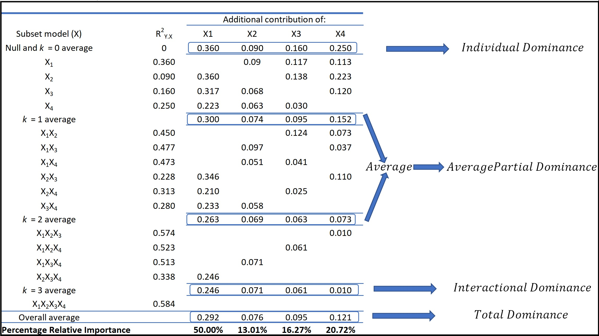

date: 20 April 2022
bibliography: paper.bib

# Summary

Dominance-Analysis is a Python library built for accurately determining the relative importance of interacting predictors in a statistical model. The variable’s individual effect as well as its effect in the presence of other variables are accounted for in identifying its proportionate contribution to the model.

The library can be used in combination with Principal Component Analysis (PCA) or Factor Analysis or any other feature reduction algorithm for getting accurate and intuitive importance of predictors. The purpose of determining predictor importance in the context of Dominance Analysis is not model selection but rather uncovering the individual contributions of the predictors. 

The library can be used for key driver analysis or marginal resource allocation models and helps marketers answer many questions like
\begin{itemize}
\item which marketing touchpoints in a sales journey have the most impact on conversions.
\item which subgroup prevalence differences in complex surveys are most important.
\item which aspects of a service influence how likely a customer would recommend a company to others.
\end{itemize}

\textbf{Package Features}

\begin{itemize}
\item Evaluates predictor importance when the analysis is either in the form of Ordinary Least Squares Regression or the Logistic Regression.
\item Allows performing Dominance Analysis even in the cases where only the Covariance / Correlation matrix of the predictor variables is available.
\item Provides the user the flexibility to choose a number of top predictors that they want to compute relative importance for.
\item Provides Complete, Conditional and General dominance analysis for models.
\end{itemize}

# Statement of need

This package is designed to get an intuitive and accurate global explanation to Machine Learning Models by determining the relative importance of predictors in the dataset. The package supports classification and regression models. The determination of relative importance depends on how one defines importance. Budescu et.al [@budescu:1993; @Razia:2001; @Razia:2003] proposed using dominance analysis (DA) because it invokes a general and intuitive definition of "relative importance" that is based on the additional contribution of a predictor in all subset models. The purpose of determining predictor importance in the context of DA is not model selection but rather uncovering the individual contributions of the predictors.

In case the target is a continuous variable, the package determines the dominance of one predictor over another by comparing their incremental R-squared contribution across all subset models [@Razia:2006; @Luo:2013]. In case the target variable is binary [@Razia:2009], the package determines the dominance over another by comparing their incremental Pseudo R-Squared contribution across all subset models.

Dominance Analysis meets three important criteria for measuring relative importance. First, the technique should be defined in terms of its ability to reduce error in predicting the outcome variable. Next, it should permit direct comparison of measures within a model (that is, $X_1$ is twice as important as $X_2$). Finally, the technique should permit inferences concerning an attribute's direct effect (that is, when considered by itself), total effect (that is, when considered with other attributes) and partial effect (that is, when considered with various combinations of other predictors). Hence, Dominance analysis is both robust, intuitive, and its interpretation is also very straightforward.

# Dominance Analysis - The Math!

Dominance Analysis is unique as it measures relative importance in a pairwise fashion, and the two predictors are compared in the context of all $2^{(p−2)}$ models that contain some subset of the other predictors. So, if we have a total of '$p$' predictors, we will build $2^p$-1 models (all possible subset models) and compute the incremental $R^2$ contribution of each predictor to the subset model of all other predictors. The additional contribution of a given predictor is measured by the increase in $R^2$ that results from adding that predictor to the regression model.

Let's consider a scenario where we have 4 predictors; $X_1$, $X_2$, $X_3$ and $X_4$. We will have to build a total of $2^4$-1 models i.e. 15 models - $^4C_1$ = 4 models with only one predictor, $^4C_2$ = 6 models with two predictors each, $^4C_3$ = 4 models with three predictors each and 1 ($^4C_4$) complete model with all 4 predictors. Thus, the additional contributions of $X_1$ are computed as the increases in the proportion of variance accounted for when $X_1$ is added to each subset of the remaining predictors (i.e., the null subset $\{.\}$, $\{X_2\}$, $\{X_3\}$, $\{X_4\}$, $\{X_2X_3\}$, $\{X_2X_4\}$, $\{X_3X_4\}$ and $\{X_2X_3X_4\}$). Similarly, the additional contributions of $X_2$ are the increases in the proportion of variance accounted for when $X_2$ is added to each subset of the remaining predictors (i.e., the null subset $\{.\}$, $\{X_1\}$, $\{X_3\}$, $\{X_4\}$, $\{X_1X_3\}$, $\{X_1X_4\}$, $\{X_3X_4\}$ and $\{X_1X_3X_4\}$).

The \autoref{fig:formulas} is the illustration of formulas used to compute the averaged additional contributions of $X_1$ and $X_2$ within model size in the population with four predictors (we use the notation $\rho^2_{Y.X}$ to represent the proportion of variance in $Y$ that is accounted for by the predictors in the model $X$. For example, $\rho^2_{Y.X_1X_3}$ represents the proportion of variance in $Y$ that is accounted for by the model consisting of $X_1$ and $X_3$. The additional contribution of a given predictor is measured by the increase in the proportion of variance that results from adding that predictor to the regression model):

The measure for the proportion of variance that we have used for regression is $R^2$ but since we don't have $R^2$ in logistic regression/classification models, we have used pseudo $R^2$.

The beauty of the math of Dominance Analysis is that the sum of the overall average incremental $R^2$ of all predictors is equal to the $R^2$ of the complete model (model with all predictors). Hence, the total $R^2$ can be attributed to each predictor in the model. The \autoref{fig:PercentRel} is an illustration of Dominance Analysis in the population for hypothetical example with four predictors:

It can bee seen that the percentage relative importance of predictors has been computed by dividing the overall average incremental $R^2$ contribution of predictors by the $R^2$ of the complete model. This explains the intuitive nature of Dominance Analysis wherein the overall $R^2$ of the model can be attributed to individual predictors within the model.

Dominance Statistics
=============================================

To intuitively determine the dominance of one predictor over another, Dominance Analysis compares their incremental R-square contribution across all subset models. Further, a relative importance measure should be able to describe a predictor’s direct, total and partial effect. To address this quantitatively, we have conceptualized and formulated four different types of dominance measures in our library i.e. interactional dominance, individual dominance, average partial dominance and total dominance.

1. **Interactional Dominance:** This measure gives an idea about the predictor's incremental impact in the presence of all other predictors. It is arrived at by subtracting the R-square value of a model with all other predictors from the R-square value of the complete model.

2. **Individual Dominance:** This measure shows the variability explained by the predictor alone in the absence of all other predictors. Mathematically, the individual dominance of a predictor is the R-square of the model between the dependent variable and the predictor variable.

3. **Average Partial Dominance:** This measure is the average of average incremental R-square contributions of the predictor to all subset models except the complete model and bi-variate (when only one predictor is present) model. Hence, this can be interpreted as the average impact that a predictor has when it is available in all possible combinations with other predictors except the combination when all predictors are available.

4. **Total Dominance:** This measure of dominance summarizes the additional contributions of each predictor to all subset models by averaging all the conditional values.

The following figure is an example explaining how each of these measures of dominance is arrived at.

The measures of dominance calculated for these predictors can be seen in figure given below.

Dominance Levels
=============================================

Dominance Analysis defines three levels of dominance while comparing each pair of predictors:

1. **Complete Dominance:** A predictor is said to completely dominate another predictor if its dominance holds across all possible subset models (that do not include the two predictors under comparison). For example, in a four-predictor model, $X_1$ is said to have complete dominance over $X_2$ when the additional R-square contribution of $X_1$ is more than that of $X_2$ for all subset models i.e. to the null model, the model consisting of $X_3$, the model consisting of $X_4$, and the model consisting of both $X_3$ and $X_4$.

2. **Conditional Dominance:** When a predictor’s averaged additional contribution within each model size is greater than that of another predictor, then the first predictor is said to conditionally dominate the latter. Here, the model size is indicated by the number of predictors included in a given model. If a predictor’s averaged additional contribution is greater for some model sizes but not for all, then conditional dominance between the two predictors cannot be established.

3. **General Dominance:** If the overall averaged additional R2 contribution of one predictor is greater than the other, then the predictor is said to generally dominate the other.

For each predictor variable, the library  lists out all the predictors that are dominated generally, conditionally, and completely by it.

# References
